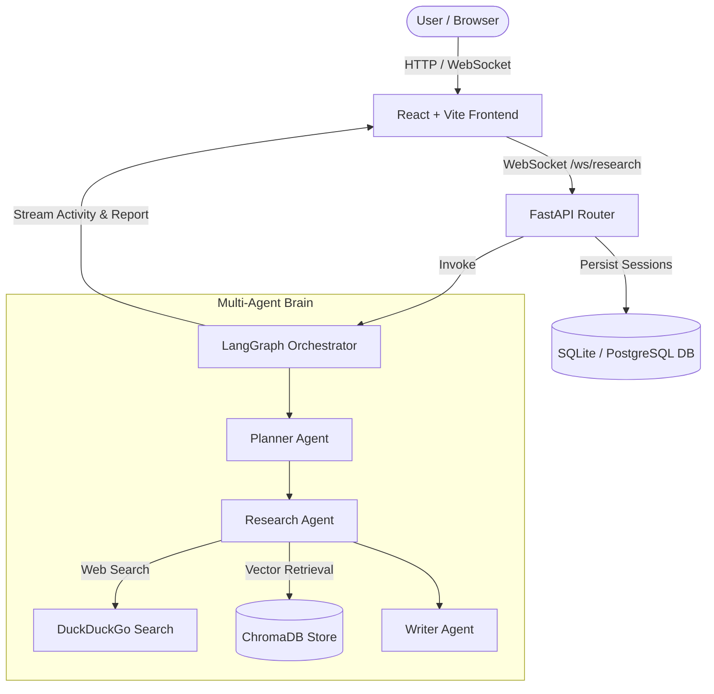

# 🚀 Insight Desk — Autonomous Multi-Agent AI Research Platform

Insight Desk is an autonomous multi-agent research assistant built with **FastAPI**, **LangGraph**, **ChromaDB**, **Ollama**, and **React + Vite**. It breaks complex research questions into structured sub-tasks, performs concurrent web and document search (RAG), and streams real-time agent activity logs to a glassmorphic dashboard before generating a cited research report.

---

## 🌟 Key Features

- 🤖 **Multi-Agent Orchestration (LangGraph)**:
  - **Planner Agent**: Deconstructs user queries into 2–4 targeted sub-tasks (web vs. document retrieval).
  - **Research Agent**: Executes web search via DuckDuckGo and semantic retrieval via ChromaDB.
  - **Writer Agent**: Synthesizes findings into a structured markdown report with inline citations (`[1]`, `[2]`).
- 📚 **Smart Memory & RAG Engine**: PDF and CSV document chunking, embedding (`nomic-embed-text`), and vector search (`ChromaDB`).
- ⚡ **Real-time Live Streaming**: WebSocket connection (`/ws/research`) streaming live agent activities to the frontend.
- 🎨 **Glassmorphism UI**: High-end dark theme design built with React, CSS variables, and animated micro-interactions.
- 🔐 **Secure Authentication**: JWT token-based authentication and user session history persistence.
- 🐳 **Dockerized Deployment**: Fully containerized environment with `docker-compose` support for PostgreSQL, FastAPI, and React.

---

## 🏗️ Architecture Overview



---

## 🚀 Quick Start Guide

### Option 1: Local Development Setup

#### 1. Backend Setup
```bash
cd backend
python -m venv venv
# On Windows PowerShell:
.\venv\Scripts\Activate.ps1

pip install -r requirements.txt
uvicorn app.main:app --reload --port 8000
```

#### 2. Ensure Ollama is Running
Make sure local Ollama is running with required models:
```bash
ollama run llama3.2
ollama pull nomic-embed-text
```

#### 3. Frontend Setup
Open a new terminal:
```bash
cd frontend
npm install
npm run dev
```
Open [http://localhost:5173](http://localhost:5173) in your browser.

---

### Option 2: Docker Compose Setup

Ensure Docker Desktop is running, then execute:

```bash
docker-compose up --build
```

- **Frontend**: [http://localhost:5173](http://localhost:5173)
- **Backend API Docs**: [http://localhost:8000/docs](http://localhost:8000/docs)

---

## 📡 API Endpoints Summary

| Method | Endpoint | Description |
| :--- | :--- | :--- |
| `POST` | `/auth/register` | Register a new user |
| `POST` | `/auth/login` | Authenticate user and receive JWT access token |
| `POST` | `/upload` | Ingest PDF or CSV document into ChromaDB session vector store |
| `WS` | `/ws/research` | Real-time WebSocket connection for multi-agent execution |
| `GET` | `/sessions` | List all historical research sessions for the user |
| `GET` | `/sessions/{id}` | Retrieve details and generated report of a specific session |

---

## 🛠️ Technology Stack

- **Backend**: Python 3.12, FastAPI, SQLAlchemy, SQLite/PostgreSQL, PyJWT
- **AI & RAG Engine**: LangChain, LangGraph, Ollama (`llama3.2`), ChromaDB, DuckDuckGo Search
- **Frontend**: React 19, Vite, Axios, React Markdown, React Router DOM, Custom Vanilla CSS Design System
- **DevOps**: Docker, Docker Compose, Uvicorn
